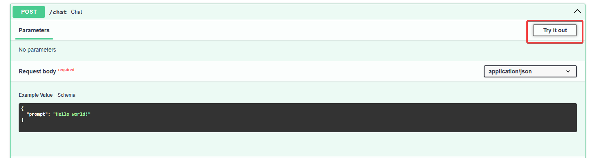

# TP Dauphine 2425

## Getting Started

### Fork the Project

Click on the "Fork" button at the top right of the page to create a copy of the repository under your own GitHub account.

### Clone the Repository

After forking the project, clone the repository to your local machine:

1. Open your terminal and navigate to the directory where you want to store the project.
2. Run the following command to clone the repository:
```bash
git clone https://github.com/{your_username}/Dauphine_2425.git
```

## Installation

Follow these steps to set up the project on your local machine:

### 1: Create a Python Virtual Environment

Creating a virtual environment helps to manage dependencies and avoid conflicts with other projects:

```bash
python3 -m venv {name_of_your_venv}
```
Or
```bash
python -m venv {name_of_your_venv}
```

### 2: Activate the Virtual Environment

Activating your virtual environment ensures that the dependencies you install will only affect this project:

on MacOS/Linux:

```bash
source {name_of_your_venv}/bin/activate
```

on Windows:

```bash
{name_of_your_venv}\Scripts\activate
```

You should see the name of your environment on the left of your terminal, indicating that it is active.

### 3: Install the Required Dependencies

Install the project's dependencies listed in the `requirements.txt` file:

```bash
pip install -r requirements.txt
```

This will install all the necessary packages to run the project. This may take a few minutes.

### 4: Launch the frontend

Ensure you are working within your activated Python environment to avoid issues. Launch the frontend of the project using Streamlit:

```bash
streamlit run ./web_app/Home.py
```

This command will start the Streamlit server, and a new tab will open in your web browser displaying the application.

Feel free to play with Streamlit's widgets!

---

## Cohere & FastAPI

Follow the steps below to set up your environment, run the provided scripts, and build your own API and graphical interface using Streamlit.

### 1. Obtain a Cohere API Key

- Visit the [Cohere website](https://cohere.ai) and sign up for an API key.
- Once obtained, store this API key in a `.env` file in the root directory of your project. The file should look something like this:

  ```plaintext
  COHERE_API_KEY=your_api_key_here
  ```

### 2. Play with Cohere through a FastAPI server

To start the FastAPI server, run the following command:

```bash
uvicorn rest.api:rest_api
```

You can interact with your API using SwaggerUI, which is automatically provided by FastAPI, or using a tool like Postman.

Access SwaggerUI by navigating to:

```bash
http://127.0.0.1:8000/docs
```

Feel free to try the chat endpoint using the "Try it out!" button and replacing the text in the _prompt_ field.



### 3. Use Cohere within Streamlit

At the root of this folder, ``main.py`` can be used to launch both the Streamlit and the FastAPI servers.

```bash
python ./main.py
```

Then, by going to the "Chat with Cohere" tab, you can start asking questions to Cohere!

## Your turn to play!

Using the current project architecture, create a new service to handle the history of messages. This service should be able to:
- retrieve an history
- store an history (JSON?)

You'll be able to give this history to Cohere to give more context to your conversation (see [cohere API documentation](https://docs.cohere.com/v1/reference/chat#request.body.chat_history)).

Going further, what if we were able to give some documents that Cohere could use to generate a more appropriate answer? You can freely use the datas in [assets](./assets/dataset).

## Special Thanks

A special thanks to William Hoareau for his work on a project that served as the foundation for my initial commit

